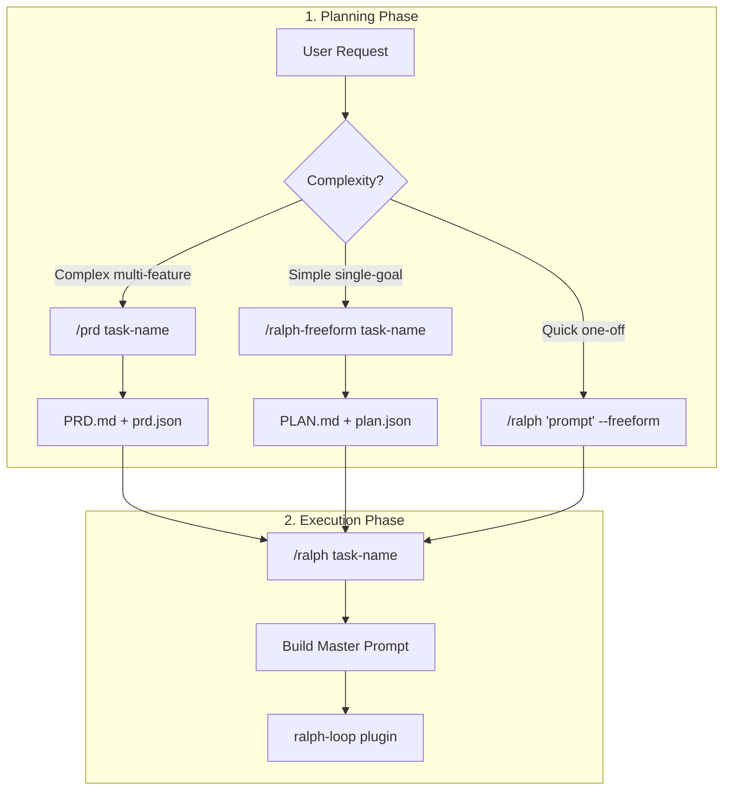
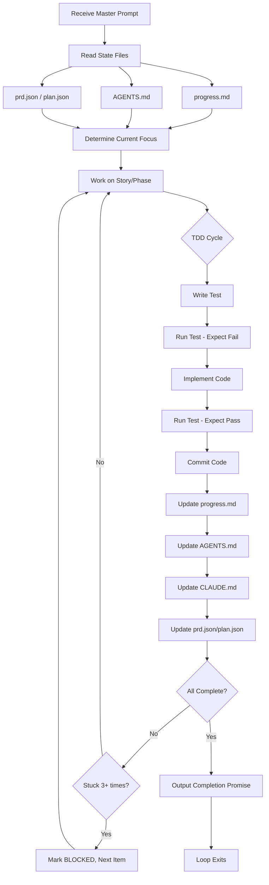
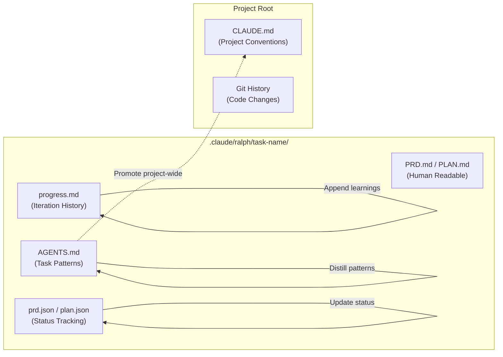

# Ralph Orchestrator Plugin

Structured orchestration for Ralph loops with PRD support, freeform plan support, progress tracking, TDD guidance, and escape hatches. Wraps the official `ralph-loop` plugin to maximize autonomous development success.

## What is Ralph?

Ralph is a development methodology based on continuous AI agent loops, inspired by [snarktank/ralph](https://github.com/snarktank/ralph). The official `ralph-loop` plugin creates a self-referential feedback loop where Claude repeatedly receives the same prompt, building on its previous work through persistent files and git history.

This plugin adds structured scaffolding to make Ralph loops more successful:
- **PRD-based planning** - Break complex work into right-sized user stories
- **Freeform planning** - Phase-based structure for simpler tasks
- **Progress tracking** - Append-only learnings that persist across iterations
- **TDD workflow** - Test-first development patterns
- **Escape hatches** - Recovery patterns when stuck

## Installation

```bash
# Add the marketplace
/plugin marketplace add app-vitals/marketplace

# Install the plugin
/plugin install ralph-orchestrator@app-vitals/marketplace

# Also install the official ralph-loop plugin (required dependency)
/plugin install ralph-loop@claude-plugins-official
```

## Visual Quick-Start

### The Core Concept

```
┌─────────────────────────────────────────────────────────────────┐
│  🔄 THE RALPH LOOP                                              │
├─────────────────────────────────────────────────────────────────┤
│                                                                 │
│      1. PLAN         →     2. EXECUTE     →     3. COMPLETE     │
│                                                                 │
│   /ralph-freeform         /ralph task        Loop exits when    │
│   or /prd                 (autonomous)       promise detected   │
│                                                                 │
└─────────────────────────────────────────────────────────────────┘
```

### Pick Your Path

| Your Task | Command | Example |
|-----------|---------|---------|
| Multi-feature project | `/prd task-name` | "Build auth system" |
| Single goal | `/ralph-freeform task-name` | "Add health endpoint" |
| Quick one-off | `/ralph "prompt" --freeform` | "Fix login bug" |

### The 3-Step Flow

```
┌─ STEP 1: PLAN ────────────────────────────────┐
│                                               │
│  $ /ralph-freeform health-endpoint            │
│                                               │
│  Claude asks clarifying questions, then       │
│  creates PLAN.md + plan.json                  │
└───────────────────────────────────────────────┘
                       │
                       ▼
┌─ STEP 2: EXECUTE ─────────────────────────────┐
│                                               │
│  $ /ralph health-endpoint                     │
│                                               │
│  Claude loops autonomously:                   │
│  • Reads progress.md for context              │
│  • Works on current phase                     │
│  • Updates state files                        │
│  • Commits working code                       │
└───────────────────────────────────────────────┘
                       │
                       ▼
┌─ STEP 3: COMPLETE ────────────────────────────┐
│                                               │
│  <promise>ALL PHASES COMPLETE</promise>       │
│                                               │
│  Loop exits. Check git log for commits!       │
└───────────────────────────────────────────────┘
```

### Example: Add a Health Endpoint

```
┌─ REAL EXAMPLE ────────────────────────────────────────────────────┐
│                                                                   │
│  1. Create plan:                                                  │
│     $ /ralph-freeform health-endpoint                             │
│                                                                   │
│  2. Answer questions:                                             │
│     Goal? → "Add /health returning {status: ok}"                  │
│     Verify? → "Run tests"                                         │
│                                                                   │
│  3. Start loop:                                                   │
│     $ /ralph health-endpoint                                      │
│                                                                   │
│  4. Watch it work:                                                │
│     ✓ P1: Explore routes                                          │
│     ✓ P2: Implement endpoint                                      │
│     ✓ P3: Add tests                                               │
│     → <promise>ALL PHASES COMPLETE</promise>                      │
│                                                                   │
└───────────────────────────────────────────────────────────────────┘
```

---

## Quick Start

> **New here?** See the [Visual Quick-Start](#visual-quick-start) above for a quick overview.

### Option 1: PRD-Based (Complex multi-feature work)

1. Create a PRD interactively:
   ```
   /prd todo-api
   ```
   Follow the prompts to define your task, success criteria, and user stories.

2. Start the Ralph loop:
   ```
   /ralph todo-api
   ```

3. Monitor progress in `.claude/ralph/todo-api/progress.md`

4. Cancel if needed:
   ```
   /cancel-ralph
   ```

### Option 2: Freeform Plan (Simpler single-goal tasks)

1. Create a freeform plan interactively:
   ```
   /ralph-freeform health-endpoint
   ```
   Follow the prompts to define your goal, success criteria, and phases.

2. Start the Ralph loop:
   ```
   /ralph health-endpoint
   ```

### Option 3: Raw Freeform (Quick one-off tasks)

For very simple tasks without any planning:

```
/ralph "Add a health check endpoint at /health that returns {status: ok}" --freeform --max-iterations 10
```

## Commands

### `/prd [task-name]`

Create a Product Requirements Document interactively. Best for complex, multi-feature work.

**Process**:
1. Asks clarifying questions (problem, success criteria, verification method)
2. Generates 3-7 right-sized user stories
3. Reviews with you for approval
4. Creates PRD.md (human-readable) and prd.json (machine-readable)

**Output**: `.claude/ralph/<task-name>/PRD.md` and `prd.json`

### `/ralph-freeform [task-name]`

Create a structured freeform plan interactively. Best for simpler, single-goal tasks.

**Process**:
1. Gathers context from your codebase automatically
2. Asks clarifying questions (goal, success criteria, verification method)
3. Generates 2-5 phases with steps
4. Reviews with you for approval
5. Creates PLAN.md (human-readable) and plan.json (machine-readable)

**Output**: `.claude/ralph/<task-name>/PLAN.md` and `plan.json`

**When to use `/ralph-freeform` vs `/prd`**:
| Use `/ralph-freeform` | Use `/prd` |
|----------------------|------------|
| Single goal/feature | Multiple features |
| 2-5 phases of work | 5+ user stories |
| "Add a health endpoint" | "Build authentication system" |
| "Fix the login bug" | "Implement user management" |

### `/ralph <task-name|prompt> [options]`

Start an orchestrated Ralph loop.

**Options**:
| Option | Description | Default |
|--------|-------------|---------|
| `--max-iterations N` | Stop after N iterations | 50 |
| `--story US-XXX` | Start with specific story (PRD mode) | First incomplete |
| `--phase P1` | Start with specific phase (Plan mode) | First incomplete |
| `--freeform` | Force raw freeform mode | Auto-detect |

**Examples**:
```bash
/ralph todo-api                          # PRD-based, default settings
/ralph health-endpoint                   # Plan-based, default settings
/ralph todo-api --max-iterations 30      # Limit iterations
/ralph todo-api --story US-003           # Start from specific story
/ralph health-endpoint --phase P2        # Start from specific phase
/ralph "Fix the login bug" --freeform    # Raw freeform mode
```

### `/cancel-ralph`

Cancel the active Ralph loop. All progress is preserved in working files.

## How It Works

### Workflow Overview



### The Iteration Loop



### File Relationships



### The Loop Mechanism

1. `/ralph` builds a structured master prompt with all scaffolding
2. The prompt is passed to `ralph-loop` from the official plugin
3. Claude works on the task
4. When Claude tries to exit, the stop hook re-feeds the same prompt
5. Claude reads progress.md to understand current state
6. Repeat until completion promise detected or max iterations

### Persistent Memory

Since each iteration receives the same prompt, Claude's "memory" comes from:

- **progress.md** - Append-only learnings, current state, iteration history
- **AGENTS.md** - Task-specific patterns and architectural decisions
- **CLAUDE.md** - Project-wide conventions (promoted from AGENTS.md)
- **prd.json** - Story completion status (PRD mode)
- **plan.json** - Phase completion status (Plan mode)
- **Git history** - Committed code from previous iterations

### Master Prompt Structure

The master prompt includes:
- Mission and completion criteria
- Instructions to read state files first
- Progress tracking requirements
- TDD workflow guidance
- Verification steps
- Escape hatch patterns
- User story list with status

## Working Files

All working files are stored in `.claude/ralph/<task-name>/`:

**PRD mode:**
```
.claude/ralph/todo-api/
├── PRD.md           # Human-readable PRD
├── prd.json         # Machine-readable PRD with story status
├── progress.md      # Learnings, state, iteration history
└── AGENTS.md        # Persistent patterns and decisions
```

**Plan mode:**
```
.claude/ralph/health-endpoint/
├── PLAN.md          # Human-readable plan
├── plan.json        # Machine-readable plan with phase status
├── progress.md      # Learnings, state, iteration history
└── AGENTS.md        # Persistent patterns and decisions
```

## Key Concepts

### Right-Sized Stories

Stories should be completable in 1-3 Ralph iterations:
- **Good**: "Add users table migration", "Create login endpoint"
- **Too big**: "Implement full authentication system"

See [story-sizing.md](skills/ralph-orchestrator/references/story-sizing.md) for details.

### The 3-Attempt Rule

If Claude tries the same approach 3 times without success:
1. Document what was tried
2. Try an alternative approach
3. If still stuck, mark story as BLOCKED and move on

This prevents infinite loops on impossible problems.

### TDD Workflow

Each story follows test-driven development:
1. Write failing test
2. Implement minimal code
3. Run test (should pass)
4. Refactor if needed
5. Commit working code

### Completion Criteria

The loop ends when Claude outputs the completion promise:
- PRD mode: `<promise>ALL STORIES PASS</promise>`
- Plan mode: `<promise>ALL PHASES COMPLETE</promise>`
- Raw freeform mode: `<promise>TASK COMPLETE</promise>`

Claude is instructed to NEVER output the promise unless all criteria are actually met.

## Best Practices

### Writing Good PRDs

1. **Clear problem statement** - What are you trying to solve?
2. **Testable success criteria** - How will you verify completion?
3. **Explicit out-of-scope** - What should NOT be attempted?
4. **Right-sized stories** - 1-3 iterations each

### Writing Good Freeform Plans

1. **Focused goal statement** - One sentence, specific outcome
2. **Testable success criteria** - 2-4 criteria with yes/no answers
3. **Right-sized phases** - 1-2 iterations per phase
4. **Clear verification** - Prefer automated checks (tests, type checks)

### Monitoring Progress

While the loop runs:
- Watch `progress.md` for learnings and state
- Check `prd.json` for story completion (PRD mode)
- Check `plan.json` for phase completion (Plan mode)
- Review git log for commits
- Cancel with `/cancel-ralph` if needed

### Resuming After Cancel

If you cancel or hit max iterations:
```
/ralph todo-api
```
The loop will continue from where it left off, reading state from progress.md.

## Troubleshooting

### Loop spinning without progress

Check progress.md for:
- Are attempts incrementing on same issue? (Escape hatch should trigger)
- Is the story/phase too big? (Break it down)
- Are there missing dependencies? (Reorder stories/phases)

### False completion

If Claude outputs completion promise prematurely:
- Review acceptance criteria clarity
- Make criteria more specific/testable
- Add verification commands

### Running out of iterations

- Increase with `--max-iterations`
- Consider if stories/phases are right-sized
- Check for blocked items that should be skipped

## Documentation

- [Prompt Patterns](skills/ralph-orchestrator/references/prompt-patterns.md) - Best practices for prompts
- [Story Sizing](skills/ralph-orchestrator/references/story-sizing.md) - How to size stories
- [Escape Hatches](skills/ralph-orchestrator/references/escape-hatches.md) - Recovery patterns

## Dependencies

- **ralph-loop** from `claude-plugins-official` - Provides the core loop mechanism
