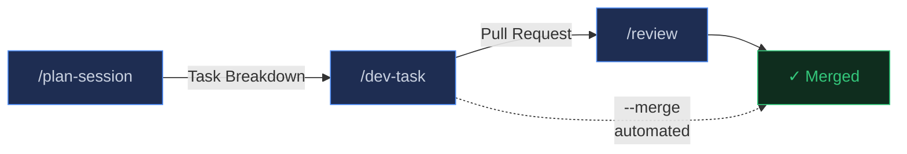
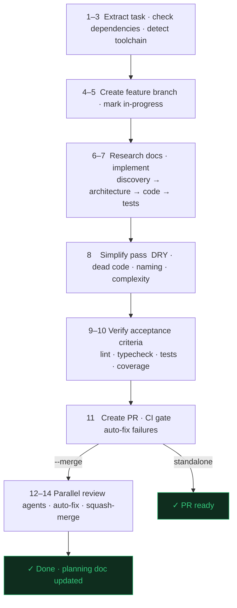
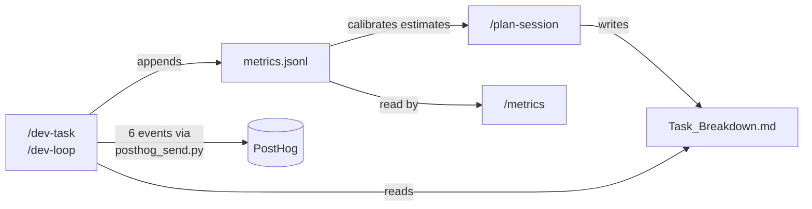

# Shipwright v4.1.3

A structured dev pipeline plugin for Claude Code. Plan sessions, execute tasks, run autonomous dev loops, perform multi-agent code reviews, and conduct integrated project research — for any software project.

A shipwright builds ships. This one ships software.

## Installation

```
/plugin install shipwright@app-vitals/marketplace
```

## The Pipeline



Every feature moves through the same stages. One `planning/{folder}/` directory ties everything together — `/plan-session` writes the task breakdown, `/dev-task` reads it and appends metrics, `/dev-loop` runs tasks continuously.

## Commands

| Command | Description |
|---------|-------------|
| `/brainstorm {folder}` | Interactive PRD session — qualifying questions, codebase research, and PRODUCT-SPEC.md output ready for /plan-session |
| `/plan-session {folder}` | Structured planning — reads input docs, analyzes codebase, produces a stateful task breakdown |
| `/dev-task {task-id}` | Single task execution — branch, implement, test, simplify, review, PR |
| `/dev-task {task-id} --merge` | Same as above, but auto-merges after review (used by dev-loop) |
| `/dev-loop {folder?}` | Autonomous continuous dev — picks next task, runs dev-task --merge in a loop |
| `/metrics {project?}` | Analyze pipeline metrics — fix cascade trends, quality rates, and recommendations |
| `/refresh-plan {folder}` | Syncs planning doc against current codebase state |
| `/review` | Auto-detecting multi-agent code review for the current branch |
| `/research {task}` | Load relevant project docs and web research for a given task |
| `/research-docs [module]` | Analyze codebase and generate or update project documentation |

## Workflow

```
/brainstorm → /plan-session → /dev-task (or /dev-loop) → /review → merge
```

### 0. Brainstorm

Have an idea but no spec yet? `/brainstorm` turns a rough concept into a structured `PRODUCT-SPEC.md` through an interactive session:

1. Detects toolchain and reads existing project context
2. Asks qualifying questions one at a time: problem statement, users, features (with depth probes per feature), constraints, out-of-scope, priorities, open questions, success criteria
3. Spawns the research agent to surface existing patterns and reuse opportunities
4. Drafts a `PRODUCT-SPEC.md` in the planning folder for review
5. Saves the approved PRD and hands off to `/plan-session`

The output is a properly formatted PRD that `/plan-session` reads directly — features labeled, acceptance criteria in checkbox format, constraints and out-of-scope documented.

### 1. Plan Session

Feed it a folder of requirements docs (PRDs, specs, wireframes). It runs 10 phases to produce a self-contained task breakdown:

| Phase | What Happens |
|-------|-------------|
| 0 | Detect toolchain · check recommended plugins |
| 1–2 | Read all docs in the planning folder · spawn researcher agent to enrich with codebase context |
| 3 | Auto-detect project layers (`src/api/` → API, `src/components/` → Frontend, etc.) · map requirements |
| 4 | Generate granular tasks (1–8h) with IDs, branches, complexity scores (1–5), and pre-answered implementation decisions · run consolidation pass |
| 5–6 | Quality checks (14 verification rules) + user review |
| 7 | Permission pre-flight for env-var prefixed commands |

**Output:** `planning/{folder}/{Project}_Task_Breakdown.md`

Every task includes estimated hours, branch name, layer, dependency chain, complexity score, pre-answered implementation decisions (edge cases, error handling, scope, performance), and acceptance criteria with coverage target.

### 2. Dev Task

```
/dev-task WS-2.1          # Stops at PR for human review
/dev-task WS-2.1 --merge  # Fully automated through merge
```



| Mode | Behavior | Best For |
|------|----------|----------|
| Standalone | Pauses after PR creation · presents handoff block with PR link | Tasks that need human review before merging |
| `--merge` | No pause points — all steps unattended | Routine tasks with clear acceptance criteria |

### 3. Dev Loop

Runs `/dev-task --merge` in a continuous loop until all tasks are done or blocked:

1. Pick next task with all dependencies `[x]` (complete)
2. Run `/dev-task --merge` — all steps, fully automated
3. Confirm merged, loop to next task

Pauses only when human judgment is genuinely needed: unmet acceptance criteria, repeated CI failures, blocked dependencies. Offers to roll back pipeline permissions when complete.

### 4. Review

Multi-agent code review that:
- Auto-detects branch and PR context
- Recovers the task ID from the branch name
- Launches parallel agents (code review, silent failure hunting, test analysis, comment review, type design)
- Verifies acceptance criteria against the diff
- Presents a confidence-scored report with structured findings
- Optionally captures learnings (if learning-loop is installed)

### 5. Refresh Plan

Updates stale tasks in a planning doc:
- Verifies file paths still exist
- Checks if dependencies have been completed
- Regenerates context fields
- Marks already-met acceptance criteria

### 6. Metrics

```
/metrics                              # all projects, all time
/metrics my-project                   # single project
/metrics --from 2026-03-01            # date filter
/metrics --compare projectA projectB  # side-by-side
```

**The fix cascade** — Shipwright's pipeline has three post-implementation phases that catch and fix issues: Simplify (Step 8), PR Review (Steps 12–14), and CI Gate (Step 11). Each fix is a signal that upstream code generation could be better. `/metrics` measures this rework and tracks it over time.

Key metrics:
- **First-time quality rate** — % of tasks with zero simplify fixes, SHIP IT verdict, and CI pass on first try
- **Simplify fix breakdown** — DRY violations, dead code, naming, complexity, consistency
- **Review verdict distribution** — SHIP IT / NEEDS FIXES / NEEDS WORK
- **CI first-pass rate** and common failure patterns
- **Estimation accuracy** by complexity tier (1–2 / 3 / 4–5)

PostHog events are fired automatically by `/dev-task` at each checkpoint — `/metrics` is pure local analysis.

### 7. Research

- `/research {task}` scans your project's `docs/` directory, selects relevant files, optionally runs web search, and returns distilled context
- `/research-docs [module]` audits your existing documentation, identifies gaps and stale content, and generates or updates docs

Research is also used automatically by `/plan-session` (Phase 2) and `/dev-task` (Step 7a) to load context before planning and implementation.

> **Migration:** If you previously installed the `research` plugin separately, uninstall it after updating shipwright: `/plugin uninstall research`

---

## Planning Folder — Shared State

Every command in the pipeline shares a single `planning/{folder}/` directory:

```
planning/april-2026-workspace-switcher/
├── PRODUCT-SPEC.md                       # Input: requirements doc
├── WorkspaceSwitcher_Task_Breakdown.md   # Written by /plan-session
└── metrics.jsonl                         # Appended by /dev-task after each task
```



---

## PostHog — Automatic Pipeline Telemetry

Set `POSTHOG_PROJECT_API_KEY` as an environment variable. If absent, all PostHog calls are silently skipped — no errors, just no events.

Events fired across the full task lifecycle:

| Event | Fired by | Trigger |
|-------|----------|---------|
| `shipwright_task_started` | `dev-task` | Task marked `in_progress` |
| `shipwright_simplify_complete` | `dev-task` | Simplify pass done |
| `shipwright_pr_created` | `dev-task` | PR created |
| `shipwright_ci_result` | `dev-task` | CI passes or exhausts retries |
| `shipwright_task_blocked` | `dev-task` | Task blocked (requirements, PR failure, CI exhausted) |
| `shipwright_task_approved` | `review` | Review verdict: SHIP IT |
| `shipwright_task_merged` | `review` | PR merged |

Build a funnel from `task_started → pr_created → task_approved → task_merged` to measure cycle time and identify where tasks drop off.

---

## Toolchain Support

Shipwright auto-detects your project's toolchain and adapts all commands accordingly:

| Ecosystem | Detection | Build | Test | Lint |
|-----------|-----------|-------|------|------|
| Node.js | `package.json` + lockfile | from scripts | from scripts | from scripts |
| Rust | `Cargo.toml` | `cargo build` | `cargo test` | `cargo clippy` |
| Go | `go.mod` | `go build ./...` | `go test ./...` | `golangci-lint run` |
| Python | `pyproject.toml` | varies | `pytest` | `ruff check` |
| Ruby | `Gemfile` | — | `rspec` | `rubocop` |
| Make | `Makefile` | `make build` | `make test` | `make lint` |

Multi-ecosystem projects (e.g., Node.js + Rust) are fully supported — validation runs for each detected ecosystem.

Monorepo detection: pnpm workspaces, npm/yarn workspaces, Lerna, Nx, Turborepo, Cargo workspaces, Go workspaces.

## Recommended Plugins

Shipwright works standalone using Claude Code's built-in agent types (`feature-dev:code-reviewer`, `general-purpose`) for all core functionality. However, it's designed to integrate with these plugins for the full experience:

| Plugin | Source | Used By | What It Enables |
|--------|--------|---------|-----------------|
| `learning-loop` | [app-vitals marketplace](https://github.com/app-vitals/marketplace) | `/review`, `/dev-task --merge` | After code review, captures patterns and recurring issues as learnings, then promotes them to CLAUDE.md so the project gets smarter over time |
| `frontend-design` | [Claude Code plugins](https://github.com/anthropics/claude-code/tree/main/plugins/frontend-design) | `/dev-task` | When a task is tagged with `Design Skill: frontend-design` in the planning doc, produces distinctive, high-quality UI instead of generic AI-generated interfaces |
| `posthog` (optional) | [PostHog plugin](https://github.com/PostHog/posthog-mcp) | `/metrics` | Enables querying PostHog pipeline data via MCP. Only needs `POSTHOG_PROJECT_API_KEY` env var for event sending — the MCP server is optional for querying |

### How Plugin Checks Work

Each command (`/plan-session`, `/dev-task`, `/review`) runs a plugin check at startup:

1. Checks for each recommended plugin by looking for its skills in the available skills list
2. If any are missing, displays which are installed vs. missing with one-liner install commands
3. Asks: "Continue without them? (Yes / Install first)"
4. In merge-mode (`/dev-task --merge`, `/dev-loop`), the check is silent — logs missing plugins and auto-proceeds

### What Happens Without Them

| Plugin | Without It | With It |
|--------|-----------|---------|
| `learning-loop` | Review findings are presented but not persisted. No `/learn` or `/learn-promote` runs. | Review findings that reveal patterns or missing conventions are captured as learnings and routed to CLAUDE.md or global config. |
| `frontend-design` | UI tasks are implemented using standard code generation following existing codebase patterns. | UI tasks tagged with Design Skill get a dedicated design pass that produces polished, distinctive interfaces. |

### Installation

```
/plugin install learning-loop@app-vitals/marketplace
/plugin install frontend-design
```

## Configuration

### Coverage Threshold

Default: 90%. Set during `/plan-session` and stored in the planning doc's Project Metadata section.

### Planning Doc Location

All commands look for planning docs at `planning/**/*_Task_Breakdown.md`. Create your planning folder under `planning/` before running `/plan-session`.

### Permissions

`/plan-session` Phase 7 auto-detects env-var prefixed commands that won't auto-approve, and presents patterns to add to `.claude/settings.local.json`. After `/dev-loop` completes, it offers to roll back pipeline-specific permissions.

## Architecture

```
shipwright/
├── .claude-plugin/
│   └── plugin.json              # Plugin manifest
├── agents/
│   └── researcher.md            # Research sub-agent (sonnet)
├── commands/
│   ├── brainstorm.md            # Interactive PRD session → PRODUCT-SPEC.md
│   ├── plan-session.md          # Planning session workflow
│   ├── dev-task.md              # Single task execution
│   ├── dev-loop.md              # Autonomous continuous loop
│   ├── metrics.md               # Pipeline metrics analysis
│   ├── refresh-plan.md          # Planning doc refresh
│   ├── research.md              # Load project docs and web research
│   ├── research-docs.md         # Generate/update project documentation
│   └── review.md                # Multi-agent code review
├── references/
│   ├── metrics-schema.md        # Metrics JSONL schema reference
│   ├── planning-doc-template.md # Task breakdown document template
│   ├── product-spec-template.md # PRODUCT-SPEC.md template for /brainstorm
│   └── toolchain-patterns.md    # Config file → command mapping
├── scripts/
│   └── posthog_send.py          # PostHog event sender (stdlib Python, no deps)
├── README.md
└── TESTING.md
```
